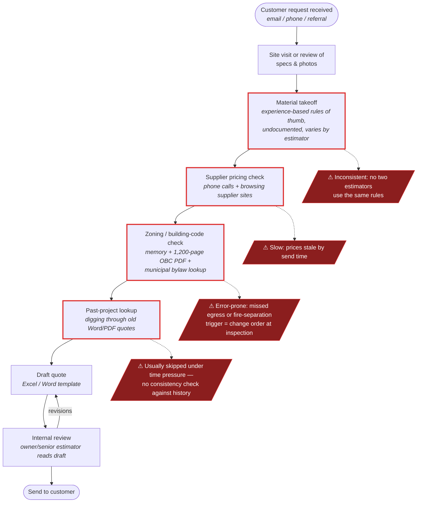
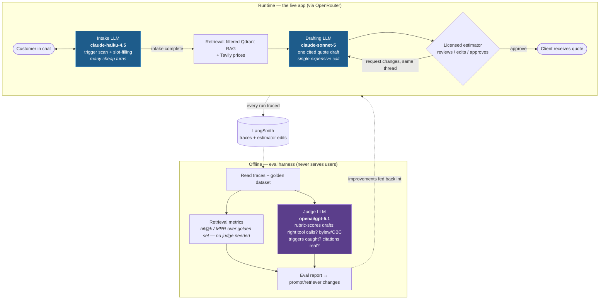

# Certification Challenge — Written Submission

**QuoteMason** — an agentic estimation assistant for residential renovation contractors · AI Engineering Certification Challenge (AI Maker Space v1.0)

---

# Task 1 — Defining Problem, Audience, and Scope

## 1.1 Problem (one sentence, no solution implied)

> Estimators at residential renovation contracting companies spend hours per quote manually cross-referencing material costs, current supplier pricing, and municipal zoning requirements, with no reliable way to check consistency against past projects.

## 1.2 Who has this problem and why today's approach fails

**Who:** the estimator (or estimating manager) at a small residential renovation/general contracting company — in our case grounded in a real partner, **Company A**, a small residential builder doing basement finishes and legal basement-apartment conversions across the GTA, London, and Kitchener-Waterloo-Cambridge region of Ontario. Not the homeowner submitting the request.

**What they're trying to do:** turn an inbound request ("finish my basement, 900 sqft, 1 bed 1 bath") into an accurate, defensible quote fast enough to win the job — without underpricing the build, and without missing a code requirement that resurfaces later as an expensive change order.

**How they handle it today:** visit the property or review submitted specs and photos; calculate a rough material takeoff from experience-based rules of thumb that are undocumented and vary estimator-to-estimator; call or browse supplier sites for current prices; separately try to recall (or look up in a 1,200-page PDF) the zoning and building-code triggers — egress for a basement bedroom, fire separation for a second unit; occasionally dig through old files for a comparable past job, a step usually skipped under time pressure; then assemble the quote in Excel/Word for internal review.

**Why that isn't good enough:** it takes hours to days per quote; results are inconsistent across estimators; pricing is often stale by send time; and a missed code trigger doesn't surface until permitting or inspection, triggering change orders and damaged client trust. Slow turnaround also loses bids outright to faster-quoting competitors. Our mining of Company A's own revised quotes quantifies the pain: **first-draft quotes were revised by −26%, −12%, and +18%** — one revision was entirely caused by a missed scope/code fork (finished basement vs. legal accessory apartment) worth **+$12,500**.

## 1.3 Current-state workflow diagram



**Reading the diagram:** the four outlined steps — takeoff, pricing check, code check, past-project lookup — are the slow, repetitive, error-prone core (hours to days end-to-end) and are the automation targets. The tools they touch today: undocumented rules of thumb, supplier websites/phone calls, the OBC compendium PDF and municipal bylaw documents, and a folder of old Word/PDF quotes. The internal-review step is deliberately **kept** in the future state — the product principle is that the agent drafts and a licensed estimator always approves.

## 1.4 Evaluation questions (seeds the Task 5 golden set)

1. **Complete spec** — "basement, 900 sqft, 1 bed, 1 bath, laminate" → returns a full estimate without unnecessary follow-up questions.
2. **Vague input** — "I want to renovate" → triggers guided follow-up (structured slot-filling), not a premature estimate.
3. **Code trigger** — basement bedroom with no obvious second egress → flags the OBC 9.9.10 egress requirement and its cost impact.
4. **Tier delta** — same spec as a completed past project, different package tier (ESSENTIAL/SUPERIOR/SUPREME) → cost delta traces to the material swaps, not fabricated differences (ground truth: [eval-q4-synthetic-pairs.md](eval-q4-synthetic-pairs.md)).
5. **Honest gaps** — finish combination with no close past-project match → says so rather than fabricating a comparable.
6. **Scope boundary** — commercial-scale request → recognizes out-of-scope and routes to the human estimator (hard-route trigger list, guideline doc §6).
7. **Citation quality** — "why does this line item cost what it does?" → answer cites the specific supplier price and/or the exact OBC/bylaw clause.

---

# Task 2 — Proposed Solution

## 2.1 Solution (one sentence)

> An agentic estimation assistant that guides a customer through structured project intake, retrieves relevant context (comparable past projects, builder guidelines, Ontario Building Code Part 9, Cambridge zoning bylaw), checks current material pricing via web search, and drafts a fully cited quote for a human estimator to review and approve before a simplified client-facing version goes out.

**Why this is the right solution:** the two adjacent product categories are commoditized — AI quote-writing (Handoff, Buildxact) and AI code-checking (free Ontario-specific tools exist). The defensible value is the **join** neither does: code/zoning triggers flagged *inside* the quote with clause-level citations, priced from the contractor's *own* past projects. The design keeps the licensed estimator as the approval gate — the agent never sends anything itself.

## 2.2 Infrastructure


One sentence per component:

| Component | Choice | Why |
|---|---|---|
| LLM gateway | **OpenRouter** | Model-swap flexibility behind one API; satisfies the gateway requirement |
| LLMs | **claude-sonnet-5** (drafting), **claude-haiku-4.5** (intake), **gpt-5.1** (judge) | Sonnet for citation-disciplined drafting at $2/$10 per 1M; Haiku for high-turn cheap intake in the same model family; judge deliberately cross-family to avoid self-preference bias |
| Agent orchestration | **LangGraph** | Explicit graph fits the intake→retrieve→draft→review flow; hands-on course experience |
| Tools | **Tavily** + past-project retriever + OBC/zoning retriever | Tavily satisfies the external-API requirement; the two retrievers map to the two required RAG data types |
| Embedding model | **OpenAI text-embedding-3-small** | Cheap, solid quality, course-consistent pairing with Qdrant |
| Vector database | **Qdrant** | One shared collection with jurisdiction/doc_type payload filters — designed for N municipalities, populated with one |
| Structured store | **Neon Postgres** | Versioned `quote_drafts` review store — the estimator gate's data model (pending_review → edited → approved, superseded on revision); a structured past-project pre-filter is a Task 6 improvement candidate |
| Memory | **Upstash Redis** | Backs the LangGraph checkpointer — the intake conversation thread survives turns/reconnects (satisfies the memory requirement) |
| Monitoring | **LangSmith** | Native LangGraph tracing; every estimator edit is logged as labeled eval data |
| Evaluation | **Golden-set metrics + LLM-as-judge** | hit@k/MRR over hand-anchored cases for retrieval quality; gpt-5.1 judge rubric for tool-call and bylaw-trigger correctness. (A RAGAS SDG path was built, then retired for cost/fragility — see §5.1) |
| UI | **Next.js chat interface** | Responsive by default — the phone + laptop browser requirement |
| Deployment | **Vercel (frontend) + Render (backend)** | Render because the Vercel + Docker-container combination didn't work; deliberate deviation from course precedent |

### Where each LLM sits

Three LLMs, two very different places. The intake and drafting models are the app; the judge is a grader that never serves a user — it runs offline in the eval harness, scoring the drafter's work after the fact.



- **Intake (`claude-haiku-4.5`)** — customer-facing and chatty: many turns per conversation, so the cheap model. Screens for §6 triggers and fills the twelve slots.
- **Drafting (`claude-sonnet-5`)** — one heavyweight call per project that composes the cited quote; the model whose output quality matters most.
- **Judge (`openai/gpt-5.1`)** — a grader, not a participant. It never talks to customers and never touches a quote; the eval harness replays LangSmith traces/dataset examples and the judge scores them against a rubric — the tool-call and bylaw-trigger correctness that the retrieval metrics can't see. Cross-family on purpose: drafts written by an Anthropic model shouldn't be graded by an Anthropic model (self-preference bias), and because the judge runs offline in batch, its cost and latency never touch the user's request path.

## 2.3 Agent workflow


**How it solves the problem (narrative):** A customer describes their project in the chat. The intake agent first screens every message against the manual-intervention trigger list (guideline doc §6): structural work, hazmat, insurance claims, permit avoidance and other hard-route conditions end drafting immediately and hand the conversation to the human estimator, while softer conditions attach a flag that travels with the draft. Clean requests go through structured slot-filling over the twelve highest-variance cost questions — the scope fork (finished basement vs. legal accessory unit), GFA, separate entrance, bedroom egress, bathroom rough-in, ceiling height and so on — and the agent only proceeds once each slot is filled or explicitly unknown. The whole conversation thread is checkpointed in Upstash Redis, so state survives reconnects (the memory requirement).

Retrieval then assembles the context the estimator would have gathered manually over hours: Qdrant semantic search finds true comparables among past projects, payload-filtered by package tier (a Neon structured pre-filter by sqft/rooms is a Task 6 improvement candidate); parallel filtered searches pull the triggered OBC Part 9 clauses, the relevant builder-guideline rules, and — for accessory-unit scope — the By-law 26-007 ARU provisions, all from the same shared collection (filtered by `jurisdiction` + `doc_type`). Tavily spot-checks current prices for volatile materials. The drafting agent composes the quote in Company A's real format — work categories, ESSENTIAL/SUPERIOR/SUPREME allowances, milestones — with every code-driven line item carrying its OBC citation, every price tracing to a comparable project or a search result, and every assumption stated. The draft is persisted to Neon Postgres as a versioned `quote_drafts` row (`pending_review`) — the estimator's review queue, not the chat stream, is the system of record. The estimator edits (each edit logged to LangSmith as labeled eval data), requests changes — which resumes the same conversation thread via the Redis checkpointer, skips intake, and produces a superseding version — or approves; sending is a `mailto:`/copy stand-in. **There is no auto-send path** — the human gate is a product principle, not a demo simplification.

---

# Task 3 — Dealing with the Data

## 3.1 Data sources and the external API

The task requires two kinds of data, and they play deliberately different roles: **RAG over personal data** supplies the slow-changing private knowledge an estimator carries in their head and filing cabinet, while the **public agentic search tool (Tavily)** supplies the one thing that private corpus can never contain — what materials cost *this week*.

### RAG corpus (personal data) — four sources, one shared Qdrant collection

| # | Source | Files | `doc_type` | Role in the solution |
|---|---|---|---|---|
| 1 | **Past renovation quotes** (Company A, PII-redacted) | 21 real projects P01–P21 + 2 synthetic tier-counterparts S01/S02 (`corpus/quotes-redacted/`, `corpus/quotes-synthetic/`) | `past_project_quote` | Comparable-project pricing: what Company A actually charged for similar scope/sqft/tier. The ESSENTIAL/SUPERIOR/SUPREME package vocabulary and real line-item structure come from here |
| 2 | **Builder guideline documents** | Guideline draft + labor-rate and material-allowance CSVs (`corpus/guidelines/`) | `builder_guideline` | Material rules of thumb, per-tier allowances, labor bands, 17 quoting rules, and the §6 manual-intervention trigger lists (HARD ROUTE / FLAG) that gate the intake agent |
| 3 | **Ontario Building Code Part 9** (2024 compendium, Phase 1 extraction) | 15 metadata-tagged section files (`corpus/OBC/part9_phase1/`) | `building_code` | Code-trigger citations: egress windows (9.9.10), fire separations (9.10.9), CO/smoke alarms (9.32.3.9, 9.10.19), ceiling heights (9.5), suite-conversion requirements (9.41) — every code-driven line item in a draft cites its clause |
| 4 | **Cambridge zoning by-law 26-007** (Dec 2025 draft, `source_version` tagged) | Extracted part files (`corpus/cambridge-zoning-bylaw/parts/`) | `zoning_bylaw` | Zoning context for the property's street + city: additional-residential-unit permissions, zone rules — the layer that grows per municipality |

Everything lives in **one shared Qdrant collection**, filtered at query time by `jurisdiction` + `doc_type` payload fields — designed for N municipalities, populated with one. Every chunk carries `{jurisdiction, doc_type, section_number, title, effective_date/source_version, source_file}`.

Two data-handling points worth noting:

- **PII is redacted before any processing.** Originals stay in a gitignored `quotes/` folder; `scripts/redact_quotes.py` strips client names/contacts, house numbers, postal codes, permit numbers, and the contractor's identity (→ "Company A"), and every downstream step uses only `corpus/quotes-redacted/`. Street names and cities are deliberately **kept** — street + city is the signal that resolves zoning context.
- **The two synthetic quotes exist for evaluation honesty.** No two real quotes share a spec across package tiers, so eval Q4 (tier-swap cost delta) had no ground truth; S01/S02 are same-spec, different-tier twins of P19/P20, marked `synthetic: true` in frontmatter and stamped "(SYNTHETIC)" in chunk text. The judge's answer key lives in `docs/`, outside the corpus, so the agent can never retrieve it.

### External API: Tavily (public agentic search)

Tavily is the agent's price-checking tool: given the material list a draft implies (flooring, vanities, egress-window units…), it searches current supplier pricing so quotes aren't built on stale numbers. This is a deliberate scope choice — agentic search, **not** live scraping of vendor sites, which is deferred. It is the "public data" half of the requirement, complementing the private corpus.

### How they interact during usage

A single drafting run touches both in sequence. Intake completes → Qdrant runs three to four filtered searches over the same collection (comparable quotes, payload-filtered by package tier; triggered OBC clauses; relevant guideline rules; ARU zoning provisions when the scope is an accessory unit) → Tavily spot-checks current prices for the volatile materials those comparables and allowances imply → the drafting model composes the quote citing **both**: the RAG corpus supplies the priors ("we charged $X for this in Oakville"; "OBC 9.9.10 requires the egress window"; "SUPERIOR flooring allowance is $Y/sqft"), and Tavily supplies the present ("that laminate is currently $Z/sqft at retail"). When a guideline rate is tagged `[PLACEHOLDER]` rather than `[GROUNDED]`, the line item is surfaced as "rate unverified" — the draft never launders an unreviewed number into an authoritative-looking price.

## 3.2 Default chunking strategy

**Decision: structure-aware chunking by section/clause boundaries, with a per-`doc_type` splitter — never fixed token windows.** Implemented in `backend/app/ingestion/chunking.py`:

| `doc_type` | Split at | Special handling |
|---|---|---|
| `building_code` | OBC article headings (`9.5.3.1. Ceiling Heights…`) | Division A defined terms are batched as whole definitions — never split inside one |
| `past_project_quote` | Numbered work-category headings (`3 ONE FULL KITCHEN:`) + boilerplate blocks (EXCLUSIONS, WARRANTY, PROJECT COST…) | Chunk prefix carries project code, city, tier, scope — and a "(SYNTHETIC)" stamp where applicable |
| `builder_guideline` | Markdown `##`/`###` headings; CSVs grouped by first column (trade/category) | CSV header row repeated in every chunk so rows stay interpretable |
| `zoning_bylaw` | By-law section headings (`4.19 Additional Residential Units (ARUs)`) | Part 3 definitions batched as whole `Term: definition` entries |

Every chunk gets its **section number + title prefixed into the chunk text itself** (e.g. `[OBC 9.9.10.1 — Egress Windows or Doors for Bedrooms | 2024 Building Code Compendium (O. Reg. 163/24)]`), on top of full metadata — so a chunk retrieved in isolation still carries its citation lineage. A size guard splits rare oversized sections at paragraph boundaries (4,000-char max, marked "(cont.)"), and an 80-char minimum drops heading residue; the guard is a backstop, structure decides the real boundaries.

**Why this decision:**

1. **Citations are a product requirement, not a nicety.** Eval Q7 requires every line item to answer "why does this cost what it does?" with the exact clause or price source. A fixed-token chunk that starts mid-sentence in 9.9.10 and ends mid-sentence in 9.10.9 can't be cited; a clause-aligned chunk with its section number in the text can.
2. **Legal/code text has hard semantic boundaries.** Fixed windows split clauses in half and glue unrelated clauses together, hurting both retrieval precision and the drafter's ability to quote requirements accurately. The same is true of quotes (work categories are the natural unit an estimator compares) and rate tables (a row torn from its header is meaningless).
3. **Idempotent re-ingestion.** Chunk IDs are deterministic (`sha256(source_file | section | position)`), so re-running ingestion upserts instead of duplicating — which is exactly what the bylaw-refresh path (`scripts/refresh_bylaw.py`, `source_version` supersession) relies on.

Validated end-to-end with `uv run python -m app.ingestion.ingest --dry-run` (chunks + stats, no API calls): **730 chunks** — 281 `past_project_quote`, 251 `building_code`, 154 `zoning_bylaw`, 44 `builder_guideline` — median 640 chars, max 4,083, no degenerate chunks.

---

# Task 4 — An End-to-End Agentic RAG Prototype

## 4.1 The prototype

The full pipeline from Task 2's diagrams is built and live: **customer chat → trigger screening → slot-filling intake → filtered RAG retrieval → Tavily price check → cited draft → estimator review gate → approve/revise** — on the locked production stack (LangGraph, OpenRouter, Qdrant Cloud, Upstash Redis, Neon Postgres, Tavily, LangSmith, FastAPI, Next.js) with commercial off-the-shelf models throughout (`claude-sonnet-5` drafting, `claude-haiku-4.5` intake, `text-embedding-3-small` embeddings).

Where each piece lives (all in this repo's `backend/` unless noted):

| Stage | Module | What it does |
|---|---|---|
| Ingestion | `app/ingestion/` | Structure-aware chunking (§3.2) → embeddings → idempotent upsert into one shared Qdrant Cloud collection (730 chunks), payload indexes created idempotently for filtered search |
| Retrieval | `app/retrieval/` | `CorpusRetriever` — filtered dense search with doc_type helpers (`search_building_code` / `search_zoning` / `search_guidelines` / `search_past_quotes`), city/tier/scope/synthetic filters, citation-bearing results |
| Agent | `app/agent/` | LangGraph graph `intake → (ask \| hard_route \| retrieve → pricing → draft)`. §6 trigger routing parses the guideline doc **at runtime** (the doc stays source-of-truth); deterministic hard-route hits override the model per §6.3. Tavily node spot-checks ≤3 volatile materials |
| Memory | `app/agent/redis_checkpointer.py` | Custom `UpstashRedisSaver` LangGraph checkpointer — the official `RedisSaver` requires RediSearch, which Upstash doesn't offer, so a plain-Redis implementation was written; threads survive reconnects and power the revision loop |
| Review gate | `app/api/` + `app/quotes/` | FastAPI: `POST /chat` (intake), `GET /quotes` (queue), `/edit` (logged to LangSmith as labeled eval data), `/revise` (resumes the same thread, new version supersedes), `/approve` (`mailto:` stand-in — **no auto-send path exists**). Drafts persist to Neon `quote_drafts`, versioned, `pending_review → edited/approved/superseded` |
| Frontend | separate `quotemason-frontend` repo | Next.js, responsive (the phone + laptop requirement): `/` fictional-brand landing page, `/estimate` customer intake chat, `/estimator` review console |

Two design decisions worth calling out because they shaped the prototype beyond "wire the pieces together":

1. **The customer never sees the draft.** On intake completion, `/chat` pauses the graph (`interrupt_before=["retrieve"]`), replies to the customer in seconds with a thank-you, and finishes retrieval → pricing → drafting in a background task that lands the draft in the estimator's queue. This makes the human gate structural, not cosmetic — the draft's only exit is through the estimator.
2. **The review gate is the system of record.** Drafts don't live in the chat stream; every completed run persists to Neon as a versioned row, estimator edits are captured and logged to LangSmith (the eval-data flywheel), and "request changes" resumes the original conversation thread through the Redis checkpointer so revisions stay context-aware.

Verified end-to-end (live, real keys): a 3-turn intake produced a 14k-character cited draft persisted to the queue; an estimator edit was logged to LangSmith; a revision request removed a scope item coherently across all sections and superseded v1; approve returned the `mailto:` stand-in. 21 backend unit tests pass with no network access (`uv run pytest`).

## 4.2 Public deployment

| Surface | Platform | URL |
|---|---|---|
| Frontend | Vercel | **<https://quotemason-frontend.vercel.app>** |
| Backend API | Render | **<https://quotemason-api.onrender.com>** (interactive docs at [`/docs`](https://quotemason-api.onrender.com/docs)) |

The backend deploys from this repo via the root [`render.yaml`](../render.yaml) Blueprint (`rootDir: backend`); the frontend deploys from its own repo on Vercel. The two are joined by exactly two knobs: `NEXT_PUBLIC_API_BASE` on Vercel points at Render, and `CORS_ORIGINS` on Render allows the Vercel origin. Render was chosen over the course's Vercel-container precedent because the Vercel + Docker combination didn't work (Task 2 table) — a deliberate, documented deviation.

Deployment verified live (2026-07-14): the frontend serves all three routes; `GET /quotes` on Render returns the Neon review-queue rows; the CORS preflight from the Vercel origin is honored (`access-control-allow-origin: https://quotemason-frontend.vercel.app`). One operational note: Render's free tier spins the API down when idle, so the first request after a quiet period takes about a minute to cold-start.

---

# Task 5 — Evaluation

## 5.1 The test dataset (assembled and hand-anchored — deliberately not synthetic)

The rubric allows the test set to be prepared *"either by generating synthetic data or by assembling an existing dataset."* This project ships the assembled path — two frozen, committed datasets in `backend/app/evals/data/`, both seeded from the seven Task 1 evaluation questions (§1.4):

| Dataset | Contents | Size |
|---|---|---|
| `retrieval_golden.jsonl` | Hand-anchored retrieval cases. Ground truth is expressed against **chunk metadata** (`section_number` / `project_code` / title matchers), not chunk text — so scores survive re-chunking and retriever swaps, which is exactly what the Task 6 comparison needs. Each case carries a reference answer, curation notes, and optional `forbidden` matchers (e.g. synthetic quotes must not surface when `include_synthetic=False`) | 24 cases: 9 building_code, 5 zoning_bylaw, 5 builder_guideline, 5 past_project_quote |
| `agent_scenarios.json` | Scripted end-to-end intake conversations, one per Task 1 eval question, each with an expected route (`draft` / `ask` / `hard_route`), expected flags, and rubric criteria for the LLM judge. Q7 (citation quality) is cross-cutting: it re-judges the drafts produced by Q1/Q3/Q4 | 7 scenarios |

**Why not synthetic.** A RAGAS SDG path was fully built (`app/evals/generate_testset.py`) and then deliberately retired. Generation over this corpus proved slow and fragile — the gpt-5.1 generator was ~10x slower and stall-prone across SDG's hundreds of structured-output calls, models kept crashing RAGAS's JSON parser until an instructor-based tool-calling wrapper was added, hung requests froze one run at 98/103 until an explicit client timeout was added, and a machine restart lost an entire overnight run because SDG writes output only at the very end. After several hours of debugging and multiple aborted generation runs' worth of API spend on a deliverable the rubric explicitly lets you satisfy by assembly, the synthetic path was cut — and the hand-anchored set is the stronger instrument anyway: it has exact clause-level ground truth (egress → OBC 9.9.10, CO alarms → 9.32.3.9 *with the 2024 renumbering encoded*) that a generator cannot produce. The SDG script and its RAGAS metrics runner (`run_ragas_eval.py`: faithfulness, answer relevancy, context precision/recall) stay in the repo, documented and runnable, for the capstone.

## 5.2 The evaluation harness

The harness (`backend/app/evals/`) has two halves that share one design rule: **the graded artifact is the real system**, not a mock — live retrieval against the ingested Qdrant collection, live LLMs through the production graph.

**Retrieval half** — `run_retrieval_eval.py` dispatches each golden case to its production doc_type helper (`search_building_code`, `search_zoning`, `search_guidelines`, `search_past_quotes` with the case's city/tier/synthetic filters) and scores **hit@k**, **MRR**, and **filter violations** (a retrieved chunk matching a `forbidden` matcher), overall and per doc_type. The retriever is selected by name (`--retriever dense` today) so Task 6 can score the hybrid retriever on the identical dataset and produce the comparison table.

**Agent half** — `run_scenario_eval.py` plays each scripted scenario through the real LangGraph agent (live intake/drafting models, live retrieval, in-memory checkpointer), then grades it twice:
1. **Deterministic checks in code** — route taken vs. expected, expected flag texts present, extra turns consumed, and for the hard-route scenario: zero dollar figures in the customer-facing reply and a routing packet present in state.
2. **Cross-family LLM judge** (`judge.py`) — `openai/gpt-5.1` scores each scenario's rubric criteria `pass`/`partial`/`fail` with quoted evidence. The judge is deliberately not an Anthropic model (the drafts are written by claude-sonnet-5 — self-preference bias) and deliberately has **no fallback array**: the run fails rather than silently grading with a different model.

Both runners emit JSON reports to `backend/eval_results/` (committed). The datasets and harness logic are covered by 20 no-network unit tests (dataset loaders/validators, matcher semantics, metric math, judge-output parsing); the full backend suite is 45 passed + 1 skip (the skip guards the retired SDG testset).

```bash
cd backend && uv run python -m app.evals.run_retrieval_eval --k 5 --json eval_results/retrieval_dense_baseline.json
cd backend && uv run python -m app.evals.run_scenario_eval --json eval_results/scenario_eval_dense.json
```

**The two graders cross-check each other, and that caught two harness bugs.** Because every scenario is scored by both a deterministic check *and* the LLM judge, disagreements between them are diagnostic. Two surfaced on the first run: (1) the judge failed Q6's "routing packet exists with fired triggers" criterion while the deterministic `routing_packet_present` check passed it — the judge simply wasn't being shown the internal packet, so the fix was to add it to the judge's evidence (labelled internal, so it can't leak into the customer-facing criteria); (2) the deterministic flag check failed Q5's "pricing confidence LOW" flag on a too-literal substring match while the judge passed the equivalent criterion — fixed by matching flag words in order with small gaps. After both fixes, Q6 moved 2/0/2 → **3/0/1** and Q5's flag check went red → green, in each case aligning the harness with the behaviour the system actually produced. The remaining Q6 and Q5 failures are real (see below).

## 5.3 Baseline results (dense retriever, run 2026-07-15)

**Retrieval** (`retrieval_dense_baseline.json`), k=5:

| Slice | n | hit@5 | MRR | Filter violations |
|---|---|---|---|---|
| **Overall** | 24 | **0.833** | **0.701** | **0** |
| building_code | 9 | 0.889 | 0.889 | 0 |
| builder_guideline | 5 | 0.800 | 0.700 | 0 |
| past_project_quote | 5 | 0.800 | 0.600 | 0 |
| zoning_bylaw | 5 | 0.800 | 0.467 | 0 |

**Agent scenarios** (`scenario_eval_dense.json`) — deterministic route check + judge criteria:

| Scenario (Task 1 eval question) | Route | Judge (pass / partial / fail) | Headline |
|---|---|---|---|
| Q1 complete spec | ✅ `draft` | 4 / 1 / 0 | Full categorized estimate, $58k on 900 sqft inside the guideline $/sqft band, HST + milestones + timeline present |
| Q2 vague input | ❌ drafted (expected `ask`) | 2 / 0 / 1 | Asked good slot-filling questions first, but after two "proceed with assumptions" nudges it drafted with $ ranges despite scope = unknown |
| Q3 code trigger (basement bedroom, no egress) | ✅ `draft` | 3 / 1 / 0 | Egress flagged **and priced** (concrete cutting, Tavily-sourced range) with OBC 9.9.10.1 cited on the line item |
| Q4 tier delta (ESSENTIAL vs. SUPERIOR twin) | ✅ `draft` | 4 / 0 / 1 | Found the right comparable (S01), refused to copy the SUPERIOR total, flagged the tier discrepancy for the estimator — but never computed the line-item delta |
| Q5 honest gap (sauna/wine-cellar/theatre) | ✅ `draft` | 2 / 1 / 1 | No fabricated comparables and pricing marked TBD-by-estimator, but the three unusual finishes silently vanished from the draft instead of being excluded per rule 5.18 |
| Q6 commercial hard-route | ✅ `hard_route` | 3 / 0 / 1 | No draft, zero pricing language to the customer; routing packet with fired triggers present (judge-confirmed). One genuine gap: the customer reply never offers estimator follow-up |
| Q7 citation quality (cross-cutting over Q1/Q3/Q4) | — | 3 / 8 / 0 | Code-driven and allowance-driven lines cite well (OBC clauses, P-codes, [PLACEHOLDER] → "rate unverified" all working); electrical/plumbing/PM lines still price without a trace |

## 5.4 Conclusions

1. **Retrieval is strong exactly where the product bet lives, and weak in ways that are keyword-shaped.** Clause-anchored building-code lookups — the "join" this product sells — hit rank 1 almost across the board (MRR 0.889). All four misses share a signature that dense embeddings are known-bad at: a vocabulary gap (customer says "legal second unit," the code calls it §9.41 "change of use"), a table lookup (R2 front-yard setback lives in a zone-standards table), a near-miss on sibling sections (§6/§6.3 retrieved when §6.1 was the target), and boilerplate-block retrieval by title. Zoning MRR (0.467) shows right-document-wrong-rank. This is precisely the case for Task 6's hybrid dense+BM25 retriever, with query rewriting (informal → code terminology) as the vocabulary-gap complement.
2. **The agent's guardrails hold where they're deterministic and leak where they're prompt-enforced.** Zero filter violations (synthetic eval-twins never surfaced with the filter on), the hard-route path produced no draft and no dollar figures, and the §6.3 no-pricing rule held. But Q2 shows the premature-estimate guardrail is soft: pushed with "proceed with reasonable assumptions," the intake obliged and drafted $ ranges around an unknown scope — the guideline's "draft only when cost-driving slots are filled *or explicitly unknown*" needs a harder floor (e.g. scope itself can never be assumption-filled).
3. **Citation discipline is real but uneven — and the eval pinpoints where.** The purpose-built paths work: egress lines cite OBC 9.9.10.1, comparables cite P-codes, [PLACEHOLDER]-derived quantities say "rate unverified." The gaps are systematic, not random: trade lines the corpus prices only implicitly (electrical, plumbing, project management) ship as bare dollar amounts, and smoke/CO-alarm requirements get mentioned without their 9.10.19/9.32.3.9 citations. That's a drafting-prompt fix (require a source line per priced item or mark it "estimator to price"), and it's measurable — Q7's criteria re-run before/after, which makes it a strong candidate for Task 6's evidence-backed second improvement.
4. **Two honest-gap behaviors diverged (Q4 vs. Q5).** The agent reliably *refuses to fabricate* (right comparable chosen, no invented projects, no asserted total when confidence is low) but handles the resulting hole passively: the tier delta never got computed and the sauna/wine-cellar/theatre items disappeared rather than being explicitly excluded with count/location per rule 5.18. Refusal is the right instinct — the missing half is surfacing what was omitted.

---

# Task 6 — Improving the Prototype

## 6a — Advanced retriever: hybrid dense + BM25

**What and why (one to two sentences):** we added a lexical **BM25** index over the same chunks and fuse it with the existing dense search via **Reciprocal Rank Fusion**. Dense embeddings blur the exact clause numbers, defined terms, and tabular values that code/zoning text turns on ("§9.41", "change of use", the R2 front-yard setback) — the Task 5 baseline missed precisely those keyword/table cases, which is the textbook signal for adding keyword retrieval.

Implementation (`backend/app/retrieval/hybrid.py`), chosen to keep the change low-risk:

- **In-process, no Qdrant migration.** The dense side is the *unchanged* `CorpusRetriever`, so the baseline stays byte-for-byte identical for the comparison below. The BM25 index is built from `build_chunks()` — the same deterministic chunks ingestion embedded — so lexical and dense hits align 1:1 by text (no separate sparse-vector collection to provision or keep in sync).
- **Clause-preserving tokenizer.** `9.9.10.1` and `26-007` tokenize as single tokens — the whole reason BM25 helps here.
- **Identical metadata filters on both halves**, then RRF fusion (constant 60) — no score normalization needed across the cosine/BM25 scales. Both halves honour the same `doc_type`/jurisdiction/tier/`synthetic` filters, so the synthetic eval-twins still never leak.
- **Config-flipped, reversible.** `settings.retriever` selects `hybrid` (now the agent default) or `dense`; the eval harness picks retrievers explicitly by name, independent of that flag, so comparisons stay apples-to-apples.

## 6b — Performance vs. the original RAG

Both retrievers scored on the identical 24-case hand-anchored golden set (`run_retrieval_eval.py`, k=5):

| Slice | n | dense hit@5 | hybrid hit@5 | dense MRR | hybrid MRR | violations |
|---|---|---|---|---|---|---|
| **Overall** | 24 | 0.833 | **0.917** | 0.701 | **0.724** | 0 → 0 |
| building_code | 9 | 0.889 | **1.000** | 0.889 | 0.870 | 0 |
| zoning_bylaw | 5 | 0.800 | **1.000** | 0.467 | **0.640** | 0 |
| past_project_quote | 5 | 0.800 | 0.800 | 0.600 | **0.700** | 0 |
| builder_guideline | 5 | 0.800 | 0.800 | 0.700 | 0.567 | 0 |

**What moved, case by case.** Two cases that dense missed entirely now hit — both exactly the failure mode we predicted: `bc-change-of-use` (OBC **9.41**, the informal-"legal second unit" → formal-"change of use" gap) went None → rank 2, and `zb-zone-standards` (the R2 front-yard setback **table**) went None → rank 2. Zoning — the weakest dense slice (MRR 0.467) — rose to 100% hit and 0.640 MRR, and the ARU cases climbed (`zb-aru-permitted` 2→1, `zb-aru-parking` 3→2).

**The honest trade-off.** Hybrid is not free: three pure-semantic cases slipped a rank or two as BM25 nudged keyword-heavy chunks up — `bc-sound` 1→3, `zb-detached-aru` 2→5, and `gl-price-anchors` 1→3 (that last one is the whole builder_guideline MRR dip, 0.700→0.567). This is the expected profile of RRF: it recovers keyword/table/clause misses at the cost of small rank churn on cases dense already nailed. Net it is a clear win — +8 points of hit@5, higher MRR, **zero filter violations preserved** — and the two remaining misses (`gl-hard-route` §6.1, `pq-exclusions-block`) are pre-existing chunking/title-match issues that neither retriever solves and BM25 does not regress.

## 6c — Second improvement: priced-line traceability (a different subsystem)

The advanced retriever (6a) improves what the drafter *sees*; 6c improves what it *writes*. Task 5's cross-cutting q7 judge found a specific, recurring drafting gap: purpose-built lines cite well (egress → OBC 9.9.10.1, flooring → a P-code comparable, [PLACEHOLDER] rates → "rate unverified"), but **bundled trade lines — electrical, plumbing, HVAC, project management — shipped as bare dollar amounts with no source trace.** That is a generation problem, not a retrieval one, which makes it a genuinely different piece of the solution.

**The change (both parts, doc-driven per project policy).** A new mandatory quoting rule, guideline **§5.19**, requires every dollar amount to show its source — ordered by preference: a comparable project code, a tier allowance or **[PLACEHOLDER] labour/material rate from the CSV** (marked "rate unverified"), or a price check — with contract-policy amounts (deposit §5.3, milestones §5.4–5.5, portable toilet §5.14, admin fees §5.6) citing their rule number, and `"estimator to price — no comparable on file"` reserved for lines nothing can ground. The rule lives in the guideline doc (source of truth, injected verbatim via `guidelines.section("5")`); the `DRAFT_SYSTEM` prompt enforces it. No code constants.

**Hard evidence (before/after on the q7 judge, both on the hybrid agent).** Measured head-on by the criterion the gap maps to — *"every priced line traces to a source."* On the two scenarios that produced a draft in both runs (q1 complete-spec, q4 tier-delta):

| q7 criterion | q1 before → after | q4 before → after |
|---|---|---|
| **Every priced line traces to a source** | partial → **pass** | partial → **pass** |
| [PLACEHOLDER] rates marked "rate unverified" | pass → pass | pass → pass |
| Excluded/capped items state count + location | pass → pass | pass → pass |

Combined over q1+q4, q7 moved from **3 pass / 5 partial** to **6 pass / 2 partial (0 fail)** — every trace-criterion partial flipped to pass with nothing regressing. The judge's own evidence confirms the mechanism: the bundled trade lines that were bare numbers now read like *"Plumbing tie-in labour … (CSV labour rate, rate unverified)"*, and the milestone/deposit amounts now cite §5.3–5.5.

**Honest caveats.** (1) This signal is variance-prone — each run regenerates live drafts and re-judges them — so it is reported as a matched before/after on the same retriever, not a single aggregate number. (2) The q3 code-trigger scenario intermittently hard-routes at intake (unrelated to this drafting change) and produced no draft in the after-run, so it is excluded from the matched pair rather than counted as a loss. (3) An intermediate version over-used the "estimator to price" escape hatch and *regressed* the rate-unverified criterion — the eval caught it, and the fix was the CSV-rate precedence now in §5.19, which satisfies both criteria at once. A supporting harness fix ships with this change: `run_scenario_eval --only` now pulls a cross-cutting scenario's judged drafts into the run (previously `--only q7-citation-quality` scored nothing).

---

# Task 7 — Next Steps (Demo Day / Capstone)

*What I plan to keep for Demo Day, and what I would change or improve — with reasoning.*

## 7.1 What I'm keeping for Demo Day

These are demo-ready and load-bearing, so they stay as-is:

- **The human review gate as the system of record.** The customer never sees a draft; every draft is a versioned Neon `quote_drafts` row (`app/quotes/store.py`) that the estimator reviews, edits, and approves. This is the non-negotiable product principle *and* the spine of the demo — the draft's only exit is through a human.
- **The "join" that differentiates the product.** Code/zoning triggers flagged *inside* the quote with clause citations, priced from the contractor's own past jobs — not "AI writes your quote," not "AI checks the code." This is the pitch; it stays central to the walkthrough.
- **Hybrid retrieval (Task 6a).** A measured win (hit@5 0.833 → 0.917, zoning MRR 0.467 → 0.640, 0 filter violations), so it stays the default retriever.
- **Structure-aware chunking + one shared collection filtered by `jurisdiction` + `doc_type`.** Already designed for N municipalities, so growth is a data task, not a redesign (see 7.2 #4).
- **Doc-driven guideline rules (§5/§6 as source of truth, injected via `guidelines.section()`).** This is why 6c was a documentation edit rather than a code change; keeping rules in the doc keeps the business owner in control of them.
- **The eval harness (hand-anchored golden set + cross-family gpt-5.1 judge) plus LangSmith estimator-edit logging.** It is both the regression guard for every future change and the seed of the data flywheel (each estimator edit is a labeled example).
- **Memory (Upstash checkpointer), async draft-in-background, and the Vercel + Render deployment.** All working end-to-end; no reason to touch them for the demo.

## 7.2 What I would change or improve (the capstone plan)

### 1. Quote-accuracy evaluation — the priority
The eval harness so far measures retrieval hit-rate and citation form — proxies for quality. It never measures the product's actual promise: how close the agent's estimate lands to what the contractor really charged. The real past-project quotes make that directly measurable.

- **Leave-one-out accuracy on real projects.** Hold a project out of retrieval (a `must_not` on its `project_code` — a filter `CorpusRetriever` already supports), have the agent estimate it from only its spec (sqft / tier / scope), and compare the result to the actual quote on three axes: total-dollar error, line-item coverage (did it catch the egress and other code-driven items the real quote carried?), and citation correctness.
- *Reasoning:* this turns the pitch from "the AI writes a quote" into "the AI's estimate lands within X% of the real one, on held-out jobs" — a number no proxy metric gives, anchored to the revised-pairs finding that real first drafts miss by ±12–26%. It reuses the existing retriever filter and golden-set runner, and it gives every other improvement a dollar-denominated scoreboard.

### 2. Material pricing — replace live web search with a price tool/data source
The current Tavily `pricing_node` (`app/agent/nodes.py:154`) runs a live per-draft web search — slow, non-deterministic, rate-limited, and hard to evaluate (a measurable source of the run-to-run variance in the 6c before/after). Replace it with a **daily price CSV the drafter reads through a tool / MCP server**, refreshed by a **separate scheduled agent** that pulls a big-box retailer's prices (e.g. Home Depot, via a direct or third-party API, or scraping) once every 24 hours, with caching for speed. Deterministic, cacheable, eval-friendly, and it reuses the allowances-CSV pattern the drafter already consumes; it also aligns with the data-freshness strategy sketched in the project brief.

### 3. Guardrails — duplicate-quote prevention
On draft creation, reject or flag when the **same email** submitted a quote within a time window, and when the **same address** (street + city) was used within a window.
- *Reasoning:* prevents spam/abuse and stops duplicate drafts from clogging the estimator's queue. It is cheap because the data already exists — the `routing_packet` carries the client email and `property_location`, and `quote_drafts` records every draft — so this is a query-on-create check, not new infrastructure.

### 4. Estimator security — authentication
Today `/estimator` is intentionally no-auth (single-persona demo convenience). Add **authentication to the console** and, on the backend, **roles and API authorization** that protect the `/quotes` endpoints and scope access per estimator.
- *Reasoning:* open access is fine for a solo demo, but the console exposes client PII and draft quotes; the review gate belongs behind a login and the API behind role checks.
