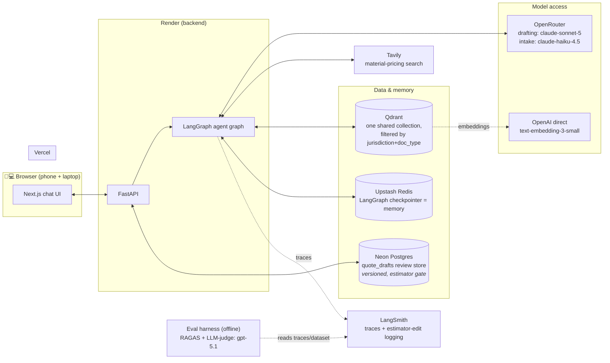
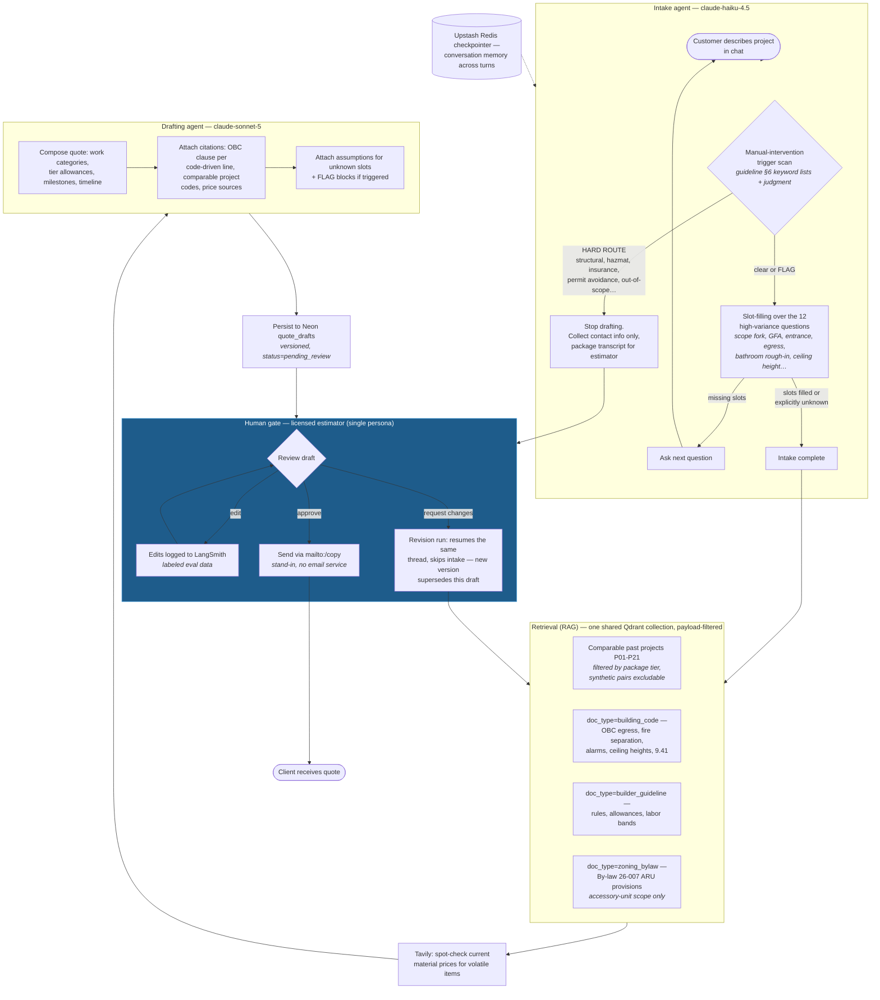

# Certification Challenge — Written Submission

**QuoteMason** — an agentic estimation assistant for residential renovation contractors · AI Engineering Certification Challenge (AI Maker Space v1.0)
Task instructions: [`challenge-instructions.md`](challenge-instructions.md) · Full project rationale: [`project-brief.md`](project-brief.md)

---

# Task 1 — Defining Problem, Audience, and Scope

## 1.1 Problem (one sentence, no solution implied)

> Estimators at residential renovation contracting companies spend hours per quote manually cross-referencing material costs, current supplier pricing, and municipal zoning requirements, with no reliable way to check consistency against past projects.

## 1.2 Who has this problem and why today's approach fails

**Who:** the estimator (or estimating manager) at a small residential renovation/general contracting company — in our case grounded in a real partner, **Company A**, a small residential builder doing basement finishes and legal basement-apartment conversions across the GTA, London, and Kitchener-Waterloo-Cambridge region of Ontario. Not the homeowner submitting the request.

**What they're trying to do:** turn an inbound request ("finish my basement, 900 sqft, 1 bed 1 bath") into an accurate, defensible quote fast enough to win the job — without underpricing the build, and without missing a code requirement that resurfaces later as an expensive change order.

**How they handle it today:** visit the property or review submitted specs and photos; calculate a rough material takeoff from experience-based rules of thumb that are undocumented and vary estimator-to-estimator; call or browse supplier sites for current prices; separately try to recall (or look up in a 1,200-page PDF) the zoning and building-code triggers — egress for a basement bedroom, fire separation for a second unit; occasionally dig through old files for a comparable past job, a step usually skipped under time pressure; then assemble the quote in Excel/Word for internal review.

**Why that isn't good enough:** it takes hours to days per quote; results are inconsistent across estimators; pricing is often stale by send time; and a missed code trigger doesn't surface until permitting or inspection, triggering change orders and damaged client trust. Slow turnaround also loses bids outright to faster-quoting competitors. Our mining of Company A's own revised quotes quantifies the pain: **first-draft quotes were revised by −26%, −12%, and +18%** — one revision was entirely caused by a missed scope/code fork (finished basement vs. legal accessory apartment) worth **+$12,500** ([full analysis](revised-pairs-analysis.md)).

## 1.3 Current-state workflow diagram

**Reading the diagram:** the four outlined steps — takeoff, pricing check, code check, past-project lookup — are the slow, repetitive, error-prone core (hours to days end-to-end) and are the automation targets. The tools they touch today: undocumented rules of thumb, supplier websites/phone calls, the OBC compendium PDF and municipal bylaw documents, and a folder of old Word/PDF quotes. The internal-review step is deliberately **kept** in the future state — the product principle is that the agent drafts and a licensed estimator always approves.

## 1.4 Evaluation questions (seeds the Task 5 golden set)

1. **Complete spec** — "basement, 900 sqft, 1 bed, 1 bath, laminate" → returns a full estimate without unnecessary follow-up questions.
2. **Vague input** — "I want to renovate" → triggers guided follow-up (structured slot-filling), not a premature estimate.
3. **Code trigger** — basement bedroom with no obvious second egress → flags the OBC 9.9.10 egress requirement and its cost impact.
4. **Tier delta** — same spec as a completed past project, different package tier (ESSENTIAL/SUPERIOR/SUPREME) → cost delta traces to the material swaps, not fabricated differences (ground truth: [eval-q4-synthetic-pairs.md](eval-q4-synthetic-pairs.md)).
5. **Honest gaps** — finish combination with no close past-project match → says so rather than fabricating a comparable.
6. **Scope boundary** — commercial-scale request → recognizes out-of-scope and routes to the human estimator (hard-route trigger list, guideline doc §6).
7. **Citation quality** — "why does this line item cost what it does?" → answer cites the specific supplier price and/or the exact OBC/bylaw clause.

---

# Task 2 — Proposed Solution

## 2.1 Solution (one sentence)

> An agentic estimation assistant that guides a customer through structured project intake, retrieves relevant context (comparable past projects, builder guidelines, Ontario Building Code Part 9, Cambridge zoning bylaw), checks current material pricing via web search, and drafts a fully cited quote for a human estimator to review and approve before a simplified client-facing version goes out.

**Why this is the right solution:** the two adjacent product categories are commoditized — AI quote-writing (Handoff, Buildxact) and AI code-checking (free Ontario-specific tools exist). The defensible value is the **join** neither does: code/zoning triggers flagged *inside* the quote with clause-level citations, priced from the contractor's *own* past projects. The design keeps the licensed estimator as the approval gate — the agent never sends anything itself.

## 2.2 Infrastructure

One sentence per component:

| Component | Choice | Why |
|---|---|---|
| LLM gateway | **OpenRouter** | Model-swap flexibility behind one API; satisfies the gateway requirement |
| LLMs | **claude-sonnet-5** (drafting), **claude-haiku-4.5** (intake), **gpt-5.1** (judge) | Sonnet for citation-disciplined drafting at $2/$10 per 1M; Haiku for high-turn cheap intake in the same model family; judge deliberately cross-family to avoid self-preference bias |
| Agent orchestration | **LangGraph** | Explicit graph fits the intake→retrieve→draft→review flow; hands-on course experience |
| Tools | **Tavily** + past-project retriever + OBC/zoning retriever | Tavily satisfies the external-API requirement; the two retrievers map to the two required RAG data types |
| Embedding model | **OpenAI text-embedding-3-small** | Cheap, solid quality, course-consistent pairing with Qdrant |
| Vector database | **Qdrant** | One shared collection with jurisdiction/doc_type payload filters — designed for N municipalities, populated with one |
| Structured store | **Neon Postgres** | Versioned `quote_drafts` review store — the estimator gate's data model (pending_review → edited → approved, superseded on revision); a structured past-project pre-filter is a Task 6 improvement candidate |
| Memory | **Upstash Redis** | Backs the LangGraph checkpointer — the intake conversation thread survives turns/reconnects (satisfies the memory requirement) |
| Monitoring | **LangSmith** | Native LangGraph tracing; every estimator edit is logged as labeled eval data |
| Evaluation | **RAGAS + LLM-as-judge** | RAGAS for retrieval quality; judge rubric for what RAGAS can't see (tool-call and bylaw-trigger correctness) |
| UI | **Next.js chat interface** | Responsive by default — the phone + laptop browser requirement |
| Deployment | **Vercel (frontend) + Render (backend)** | Render because the Vercel + Docker-container combination didn't work; deliberate deviation from course precedent |

### Where each LLM sits

Three LLMs, two very different places. The intake and drafting models are the app; the judge is a grader that never serves a user — it runs offline in the eval harness, scoring the drafter's work after the fact.

- **Intake (`claude-haiku-4.5`)** — customer-facing and chatty: many turns per conversation, so the cheap model. Screens for §6 triggers and fills the twelve slots.
- **Drafting (`claude-sonnet-5`)** — one heavyweight call per project that composes the cited quote; the model whose output quality matters most.
- **Judge (`openai/gpt-5.1`)** — a grader, not a participant. It never talks to customers and never touches a quote; the eval harness replays LangSmith traces/dataset examples and the judge scores them against a rubric — the tool-call and bylaw-trigger correctness that RAGAS's retrieval metrics can't see. Cross-family on purpose: drafts written by an Anthropic model shouldn't be graded by an Anthropic model (self-preference bias), and because the judge runs offline in batch, its cost and latency never touch the user's request path.

## 2.3 Agent workflow

**How it solves the problem (narrative):** A customer describes their project in the chat. The intake agent first screens every message against the manual-intervention trigger list (guideline doc §6): structural work, hazmat, insurance claims, permit avoidance and other hard-route conditions end drafting immediately and hand the conversation to the human estimator, while softer conditions attach a flag that travels with the draft. Clean requests go through structured slot-filling over the twelve highest-variance cost questions — the scope fork (finished basement vs. legal accessory unit), GFA, separate entrance, bedroom egress, bathroom rough-in, ceiling height and so on — and the agent only proceeds once each slot is filled or explicitly unknown. The whole conversation thread is checkpointed in Upstash Redis, so state survives reconnects (the memory requirement).

Retrieval then assembles the context the estimator would have gathered manually over hours: Qdrant semantic search finds true comparables among past projects, payload-filtered by package tier (a Neon structured pre-filter by sqft/rooms is a Task 6 improvement candidate); parallel filtered searches pull the triggered OBC Part 9 clauses, the relevant builder-guideline rules, and — for accessory-unit scope — the By-law 26-007 ARU provisions, all from the same shared collection (filtered by `jurisdiction` + `doc_type`). Tavily spot-checks current prices for volatile materials. The drafting agent composes the quote in Company A's real format — work categories, ESSENTIAL/SUPERIOR/SUPREME allowances, milestones — with every code-driven line item carrying its OBC citation, every price tracing to a comparable project or a search result, and every assumption stated. The draft is persisted to Neon Postgres as a versioned `quote_drafts` row (`pending_review`) — the estimator's review queue, not the chat stream, is the system of record. The estimator edits (each edit logged to LangSmith as labeled eval data), requests changes — which resumes the same conversation thread via the Redis checkpointer, skips intake, and produces a superseding version — or approves; sending is a `mailto:`/copy stand-in. **There is no auto-send path** — the human gate is a product principle, not a demo simplification.

---

# Task 3 — Dealing with the Data

## 3.1 Data sources and the external API

The task requires two kinds of data, and they play deliberately different roles: **RAG over personal data** supplies the slow-changing private knowledge an estimator carries in their head and filing cabinet, while the **public agentic search tool (Tavily)** supplies the one thing that private corpus can never contain — what materials cost *this week*.

### RAG corpus (personal data) — four sources, one shared Qdrant collection

| # | Source | Files | `doc_type` | Role in the solution |
|---|---|---|---|---|
| 1 | **Past renovation quotes** (Company A, PII-redacted) | 21 real projects P01–P21 + 2 synthetic tier-counterparts S01/S02 (`corpus/quotes-redacted/`, `corpus/quotes-synthetic/`) | `past_project_quote` | Comparable-project pricing: what Company A actually charged for similar scope/sqft/tier. The ESSENTIAL/SUPERIOR/SUPREME package vocabulary and real line-item structure come from here |
| 2 | **Builder guideline documents** | Guideline draft + labor-rate and material-allowance CSVs (`corpus/guidelines/`) | `builder_guideline` | Material rules of thumb, per-tier allowances, labor bands, 17 quoting rules, and the §6 manual-intervention trigger lists (HARD ROUTE / FLAG) that gate the intake agent |
| 3 | **Ontario Building Code Part 9** (2024 compendium, Phase 1 extraction) | 15 metadata-tagged section files (`corpus/OBC/part9_phase1/`) | `building_code` | Code-trigger citations: egress windows (9.9.10), fire separations (9.10.9), CO/smoke alarms (9.32.3.9, 9.10.19), ceiling heights (9.5), suite-conversion requirements (9.41) — every code-driven line item in a draft cites its clause |
| 4 | **Cambridge zoning by-law 26-007** (Dec 2025 draft, `source_version` tagged) | Extracted part files (`corpus/cambridge-zoning-bylaw/parts/`) | `zoning_bylaw` | Zoning context for the property's street + city: additional-residential-unit permissions, zone rules — the layer that grows per municipality |

Everything lives in **one shared Qdrant collection**, filtered at query time by `jurisdiction` + `doc_type` payload fields — designed for N municipalities, populated with one. Every chunk carries `{jurisdiction, doc_type, section_number, title, effective_date/source_version, source_file}`.

Two data-handling points worth noting:

- **PII is redacted before any processing.** Originals stay in a gitignored `quotes/` folder; `scripts/redact_quotes.py` strips client names/contacts, house numbers, postal codes, permit numbers, and the contractor's identity (→ "Company A"), and every downstream step uses only `corpus/quotes-redacted/`. Street names and cities are deliberately **kept** — street + city is the signal that resolves zoning context.
- **The two synthetic quotes exist for evaluation honesty.** No two real quotes share a spec across package tiers, so eval Q4 (tier-swap cost delta) had no ground truth; S01/S02 are same-spec, different-tier twins of P19/P20, marked `synthetic: true` in frontmatter and stamped "(SYNTHETIC)" in chunk text. The judge's answer key lives in `docs/`, outside the corpus, so the agent can never retrieve it.

### External API: Tavily (public agentic search)

Tavily is the agent's price-checking tool: given the material list a draft implies (flooring, vanities, egress-window units…), it searches current supplier pricing so quotes aren't built on stale numbers. This is a deliberate scope choice — agentic search, **not** live scraping of vendor sites, which is deferred. It is the "public data" half of the requirement, complementing the private corpus.

### How they interact during usage

A single drafting run touches both in sequence. Intake completes → Qdrant runs three to four filtered searches over the same collection (comparable quotes, payload-filtered by package tier; triggered OBC clauses; relevant guideline rules; ARU zoning provisions when the scope is an accessory unit) → Tavily spot-checks current prices for the volatile materials those comparables and allowances imply → the drafting model composes the quote citing **both**: the RAG corpus supplies the priors ("we charged $X for this in Oakville"; "OBC 9.9.10 requires the egress window"; "SUPERIOR flooring allowance is $Y/sqft"), and Tavily supplies the present ("that laminate is currently $Z/sqft at retail"). When a guideline rate is tagged `[PLACEHOLDER]` rather than `[GROUNDED]`, the line item is surfaced as "rate unverified" — the draft never launders an unreviewed number into an authoritative-looking price.

## 3.2 Default chunking strategy

**Decision: structure-aware chunking by section/clause boundaries, with a per-`doc_type` splitter — never fixed token windows.** Implemented in `backend/app/ingestion/chunking.py`:

| `doc_type` | Split at | Special handling |
|---|---|---|
| `building_code` | OBC article headings (`9.5.3.1. Ceiling Heights…`) | Division A defined terms are batched as whole definitions — never split inside one |
| `past_project_quote` | Numbered work-category headings (`3 ONE FULL KITCHEN:`) + boilerplate blocks (EXCLUSIONS, WARRANTY, PROJECT COST…) | Chunk prefix carries project code, city, tier, scope — and a "(SYNTHETIC)" stamp where applicable |
| `builder_guideline` | Markdown `##`/`###` headings; CSVs grouped by first column (trade/category) | CSV header row repeated in every chunk so rows stay interpretable |
| `zoning_bylaw` | By-law section headings (`4.19 Additional Residential Units (ARUs)`) | Part 3 definitions batched as whole `Term: definition` entries |

Every chunk gets its **section number + title prefixed into the chunk text itself** (e.g. `[OBC 9.9.10.1 — Egress Windows or Doors for Bedrooms | 2024 Building Code Compendium (O. Reg. 163/24)]`), on top of full metadata — so a chunk retrieved in isolation still carries its citation lineage. A size guard splits rare oversized sections at paragraph boundaries (4,000-char max, marked "(cont.)"), and an 80-char minimum drops heading residue; the guard is a backstop, structure decides the real boundaries.

**Why this decision:**

1. **Citations are a product requirement, not a nicety.** Eval Q7 requires every line item to answer "why does this cost what it does?" with the exact clause or price source. A fixed-token chunk that starts mid-sentence in 9.9.10 and ends mid-sentence in 9.10.9 can't be cited; a clause-aligned chunk with its section number in the text can.
2. **Legal/code text has hard semantic boundaries.** Fixed windows split clauses in half and glue unrelated clauses together, hurting both retrieval precision and the drafter's ability to quote requirements accurately. The same is true of quotes (work categories are the natural unit an estimator compares) and rate tables (a row torn from its header is meaningless).
3. **Idempotent re-ingestion.** Chunk IDs are deterministic (`sha256(source_file | section | position)`), so re-running ingestion upserts instead of duplicating — which is exactly what the bylaw-refresh path (`scripts/refresh_bylaw.py`, `source_version` supersession) relies on.

Validated end-to-end with `uv run python -m app.ingestion.ingest --dry-run` (chunks + stats, no API calls): **730 chunks** — 281 `past_project_quote`, 251 `building_code`, 154 `zoning_bylaw`, 44 `builder_guideline` — median 640 chars, max 4,083, no degenerate chunks.

---

# Task 4 — An End-to-End Agentic RAG Prototype

## 4.1 The prototype

The full pipeline from Task 2's diagrams is built and live: **customer chat → trigger screening → slot-filling intake → filtered RAG retrieval → Tavily price check → cited draft → estimator review gate → approve/revise** — on the locked production stack (LangGraph, OpenRouter, Qdrant Cloud, Upstash Redis, Neon Postgres, Tavily, LangSmith, FastAPI, Next.js) with commercial off-the-shelf models throughout (`claude-sonnet-5` drafting, `claude-haiku-4.5` intake, `text-embedding-3-small` embeddings).

Where each piece lives (all in this repo's `backend/` unless noted):

| Stage | Module | What it does |
|---|---|---|
| Ingestion | `app/ingestion/` | Structure-aware chunking (§3.2) → embeddings → idempotent upsert into one shared Qdrant Cloud collection (730 chunks), payload indexes created idempotently for filtered search |
| Retrieval | `app/retrieval/` | `CorpusRetriever` — filtered dense search with doc_type helpers (`search_building_code` / `search_zoning` / `search_guidelines` / `search_past_quotes`), city/tier/scope/synthetic filters, citation-bearing results |
| Agent | `app/agent/` | LangGraph graph `intake → (ask \| hard_route \| retrieve → pricing → draft)`. §6 trigger routing parses the guideline doc **at runtime** (the doc stays source-of-truth); deterministic hard-route hits override the model per §6.3. Tavily node spot-checks ≤3 volatile materials |
| Memory | `app/agent/redis_checkpointer.py` | Custom `UpstashRedisSaver` LangGraph checkpointer — the official `RedisSaver` requires RediSearch, which Upstash doesn't offer, so a plain-Redis implementation was written; threads survive reconnects and power the revision loop |
| Review gate | `app/api/` + `app/quotes/` | FastAPI: `POST /chat` (intake), `GET /quotes` (queue), `/edit` (logged to LangSmith as labeled eval data), `/revise` (resumes the same thread, new version supersedes), `/approve` (`mailto:` stand-in — **no auto-send path exists**). Drafts persist to Neon `quote_drafts`, versioned, `pending_review → edited/approved/superseded` |
| Frontend | separate `quotemason-frontend` repo | Next.js, responsive (the phone + laptop requirement): `/` fictional-brand landing page, `/estimate` customer intake chat, `/estimator` review console |

Two design decisions worth calling out because they shaped the prototype beyond "wire the pieces together":

1. **The customer never sees the draft.** On intake completion, `/chat` pauses the graph (`interrupt_before=["retrieve"]`), replies to the customer in seconds with a thank-you, and finishes retrieval → pricing → drafting in a background task that lands the draft in the estimator's queue. This makes the human gate structural, not cosmetic — the draft's only exit is through the estimator.
2. **The review gate is the system of record.** Drafts don't live in the chat stream; every completed run persists to Neon as a versioned row, estimator edits are captured and logged to LangSmith (the eval-data flywheel), and "request changes" resumes the original conversation thread through the Redis checkpointer so revisions stay context-aware.

Verified end-to-end (live, real keys): a 3-turn intake produced a 14k-character cited draft persisted to the queue; an estimator edit was logged to LangSmith; a revision request removed a scope item coherently across all sections and superseded v1; approve returned the `mailto:` stand-in. 21 backend unit tests pass with no network access (`uv run pytest`).

## 4.2 Public deployment

| Surface | Platform | URL |
|---|---|---|
| Frontend | Vercel | **<https://quotemason-frontend.vercel.app>** |
| Backend API | Render | **<https://quotemason-api.onrender.com>** (interactive docs at [`/docs`](https://quotemason-api.onrender.com/docs)) |

The backend deploys from this repo via the root [`render.yaml`](../render.yaml) Blueprint (`rootDir: backend`); the frontend deploys from its own repo on Vercel. The two are joined by exactly two knobs: `NEXT_PUBLIC_API_BASE` on Vercel points at Render, and `CORS_ORIGINS` on Render allows the Vercel origin. Render was chosen over the course's Vercel-container precedent because the Vercel + Docker combination didn't work (Task 2 table) — a deliberate, documented deviation.

Deployment verified live (2026-07-14): the frontend serves all three routes; `GET /quotes` on Render returns the Neon review-queue rows; the CORS preflight from the Vercel origin is honored (`access-control-allow-origin: https://quotemason-frontend.vercel.app`). One operational note: Render's free tier spins the API down when idle, so the first request after a quiet period takes about a minute to cold-start.

---

*Tasks 5–7 are appended as they are completed.*
